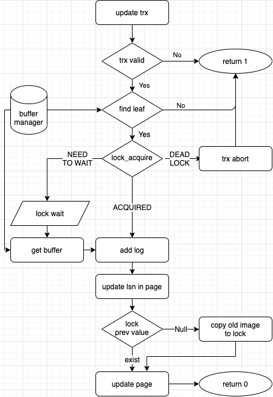

# Table of Contents
- [Overall Layered Architecture](#overall-layered-architecture)
    + [interface.c](#interfacec)
  * [index layer](#index-layer)
  * [buffer layer](#buffer-layer)
    + [page.cc](#pagecc)
    + [buffer.cc](#buffercc)
  * [Disk space layer](#disk-space-layer)
    + [table.cc](#tablecc)
    + [file.cc](#filecc)
- [Concurrency Control Implementation](#concurrency-control-implementation)
  * [trx table and lock table](#trx-table-and-lock-table)
  * [lock dependency](#lock-dependency)
  * [update trx](#update-trx)
  * [lock acquire](#lock-acquire)
  * [deadlock detection](#deadlock-detection)
  * [lock wait](#lock-wait)
  * [lock release](#lock-release)
  * [rollback](#rollback)
- [Crash-Recovery Implementation](#crash-recovery-implementation)
  * [WAL](#wal)
  * [log buffer](#log-buffer)
  * [log init](#log-init)
  * [ARIES](#aries)
  * [Analysis Pass](#analysis-pass)
  * [Redo Pass](#redo-pass)
  * [Undo Pass](#undo-pass)

# Overall Layered Architecture

### interface.c
`interface.c` 파일은 user에게 dbms에 접근할 수 있는 함수를 제공한다. `open_table()`, `db_insert()`, `db_find()`, `db_delete()`  등의 함수가 있다. 이 함수들은 아래 레이어에서 관련된 함수를 호출한다.

## index layer
페이지들을 b+ tree의 구조를 유지하며 record 삭제, 추가, 검색을 지원한다. find, update 함수는 ACID의 A와 D 조건을 만족하도록 강화되었다. 내부적으로 pagenum으로 페이지들을 처리하고, buffer layer의 함수들로 페이지나 버퍼 구조체를 가져온다.

## buffer layer
### page.cc
`page.cc` 는 버퍼 구조체의 frame을 특정 타입 페이지로 바꾸는 등의 함수, 페이지 alloc, free 를 담당하는 함수, 페이지 내부 값 변경 등의 utility function이 있다.

### buffer.cc
LRU policy를 따르는 buffer manager이다. double linked list를 통해 buffer를 구성했다. 버퍼를 찾을 때는 최근 접근한 페이지부터,  새로운 페이지가 필요할 때는 가장 오래된 페이지부터 찾게 된다.

buffer manager 자체에 대한 lock을 위해 `buffer mgr latch`를, 페이지마다  `page latch` 가 존재한다.

## Disk space layer
### table.cc
테이블의 열기, 닫기 등을 담당한다. 열려 있는 파일들의 fd 를 배열로 관리한다.

### file.cc
페이지를 읽고 쓰고, 파일을 열고 닫고 크기를 변경하는 함수들을 low level로 제공한다.

# Concurrency Control Implementation
concurrency control은 index layer, recovery layer, interface layer 와 걸쳐서 구현되었습니다. interface에서는 `commit`, `abort`, `begin` 함수를 `trx.cc` 파일에서 호출합니다. `find_trx.cc` 에서는, 트랜잭션이 레코드에 atomicity하게 접근하기 위해 `lock_acquire` 함수를 `lock.cc`  함수를 통해 접근합니다. `lock.cc` 에서는 `trx.cc` 의  트랜잭션 자료구조과 자신의 `lock table` 자료구조를 활용하여 deadlock 등을 검사합니다.

## trx table and lock table
`lock.cc` 에서는 레코드별로 어떤 트랜잭션이 접근하고 있는지 검사하기 위해 hash table을 사용해 `lock table` 자료구조를 유지합니다. 이때 `lock manager latch` 를 통해 하나의 스레드만 접근해서 자료구조를 업데이트 하도록 만듭니다.
`trx.cc` 에서는 트랜잭션별로 어떤 작업을 수행하고 어떤 락을 가졌는지를 저장하기 위해  linked list 형태로 값을 저장합니다. 역시 `trx manager latch` 를 두어 한 스레드만 접근할 수 있도록 합니다.  추가적으로 `trx latch` 가 있어서, 트랜잭션별로 추가적인 lock을 사용할 수 있습니다.

## lock dependency

현재 구현에서는 락의 잡는 순서가 위와 같이 정해지게 되었습니다.
만약 control flow 중에 이 lock 순서를 지키지 않고 거꾸로 잡는 경우가 존재할 경우, deadlock이 발생하게 됩니다.

## update trx

concurrency control를 구현하기 위해서는, index layer의 find, update 또한 해당 조건을 만족하도록 바뀌어야 합니다. 여기서 find는 update에서 페이지 업데이트 부분만 빼면 되기 때문에, update를 자세히 다루도록 하겠습니다.

가장 먼저 주어진 trx가 유효한 trx인지 확인합니다. `trx_vaild` 이 함수는  해당 trx num이 현재 trx table에 존재하는지 확인합니다. 이를 통해서 abort되거나 끝난 trx에 대한 예외처리를 진행합니다.
그 뒤 주어진 레코드의 leaf page를 찾습니다. `get_buffer` 함수는 `buffer_mgr_latch`  를 잡고 페이지를 불러온 뒤 `page_latch` 를 설정해 다른 스레드가 해당 페이지를 가져갈 수 없게 한 뒤, `buffer_mgr_latch` 를 해제합니다. 

레코드가 해당 페이지에 있는 것을 확인했다면, `lock_acquire` 함수로 해당 레코드에 대한 락을 잡기를 시도합니다.
`lock_acquire` 함수가 끝났을 때 acquire를 리턴한다면, **즉 이 레코드에 맨 처음 있는(혹은 읽기를 동시에 실행하는) 쓰레드라는 의미입니다.**
`need_to_wait` 를 리턴한다면, deadlock 상황은 아니지만 기다려야 한다는 뜻입니다. `lock_wait` 함수를 통해 trx latch 를 atomic하게 release하여 잠이 들게 되고, 차례가 되면 깨어나게 됩니다. 그 후 다시 버퍼 페이지를 불러옵니다.
`deadlock`을 리턴한다면, `trx_abort` 함수로 트랜잭션을 rollback합니다. 그 후 1을 리턴합니다. 
락을 정상적으로 획득하였다면,  값을 업데이트를  하기 전에 로그를 작성합니다. abort 시 복구를 하기 위해서,  `lock_t` 구조체에 있는 `prev_value` 함수가 `nullptr` 이라면, 값을 덮어쓰기 전에 기존 값을 할당해서 저장해 놓습니다.

## lock acquire

`lock.cc` 파일의 함수입니다. 먼저 hash table에서 해당 id, key의 자료구조로 find를 수행합니다.
만약 찾지 못했다면, lock table에 존재하지 않는다는 뜻이므로 entry를 초기화 해 hash table에 insert를 수행합니다.
그 후 entry에 lock을 초기화해서 추가해줍니다. 
만약 entry의 head가 null이라면, 이는 첫번째로 접근하는 것이기 때문에 lock을 잡았다는 뜻이고 해당 lock과 ACQUIRED 코드를 리턴합니다.
lock이 자기 자신의 lock이라면, 한 trx에서 락이 두 개 이상 존재하려면, trx가 이미 실행되고 있다는 점이 중요합니다. **즉 앞에 있는 자신의 lock은 이미 실행이 완료된 작업의 lock입니다.** 따라서 일반적인 경우 자신의 lock을 다시 리턴할 수 있습니다.
기존 락과 동일한 수준의 락은 그대로 리턴하는 것은 당연합니다. 또한  트랜잭션이 이미 획득한 lock의 mode가 나중에 획득하려는 mode보다 더 강력하다면 뒤에 획득하려는 lock은 이미 획득한 lock으로 대체되어 사용되어도 안전합니다.
이 때 s - x 인 경우가 문제입니다.
이 경우, entry에서 지금 실행된 s와 x 사이에, 다른 누구의 trx도 존재하지 않는다면 serializable이라고 할 수 있을 것입니다.
따라서 s - x 인 경우 다른  trx가 존재하면 abort를, 존재하지 않다면 나 혼자 락을 가졌다는 의미이므로 lock mode를 올려서 리턴해줍니다.
null이 아니라면 이미 다른 쓰레드가 있다는 것이므로, entry에 새로운 lock을 추가합니다.
그 뒤 lock을 가지고 deadlock detection을 수행하게 됩니다.

## deadlock detection

이 함수는 lock table 자료구조를 돌며 depth-first search를 수행합니다.
현재 trx가 다음 lock이 존재한다면, 재귀 호출로 끝부터 업데이트합니다.
그 후, 현재 lock이 위치한 entry에서 앞으로 이동하면서 자신과 exclusive 한 lock이 존재한다면, 해당 trx와 wait하는 종속성이 생기는 것이므로 wait graph에 edge를 추가하고, 해당 trx로 wait graph를 재귀적으로 build합니다.
이 이후 만들어진 wait graph에서 일반적인 cycle detection을 하여 deadlock을 detect하게 됩니다.

## lock wait

deadlock이 없이 lock을 획득하였더라도, 트랜젝션이 wait를 해야할 경우가 있을 수 있습니다. 이때는 자신의 trx latch를 잡고 wait에 들어가게 됩니다.  trx manager latch를 잡고 trx latch를 잡은 뒤, trx manager latch, lock manager latch를 풀고 잠에 들어가게 됩니다.

## lock release
만약 내 뒤에 누군가 기다린다면, 내 다음에 실행될 수 있는 trx들에 대해 `trx latch`를 잡고 `lock->cond`  변수를 사용해 해당 thread를 깨웁니다. 동적할당된 본인의 lock을 해제해 release를 수행합니다.

## rollback
abort를 위해 lock구조체에 `char *prev_value`가 존재합니다. 이 변수는 update가 맨 처음 이뤄질 때, update trx 함수 안에서 기존 값을 동적 할당해 복사해서 저장합니다.
그런데, 위의 lock dependency로 인해, lock manager latch 또는 trx manager latch를 잡은 후 buffer manager에 접근하는 것이 불가능합니다.
이 말은 rollback이 진행 중에 다른 trx이 실행되어 lock manager, trx manager에 접근하는 것이 가능하다는 뜻입니다.
먼저 trx manager를 잡고 현재 trx의 맨 처음 락을 가져옵니다.
그 후 trx manager를 풀고 trx들의 lock을 따라갑니다.
이것이 가능한 이유는 lock manager는 trx next 를 수정하지 않고, lock이 동적 할당되어 이 주소를 바꾸지 않기 때문입니다.
그리고 락에 undo image가 존재하는 경우는, 이미 이 트랜잭션이 맨 앞에 있고 락을 획득한 상태이며 값을 바꾸었다는 것을 의미합니다.
이때에만 값을 update 해주게 됩니다. 이 경우 이미 맨 앞에 있기 때문에 lock manger를 거칠 필요가 없습니다.
abort 할 때만 이 작업이 수행되기 때문에 위에서 이를 회색 화살표로 표현하였습니다.
모든 rollback이 완료되면, lock manager를 잡고 trx를 차례차례 삭제한 뒤, rollback log를 발급후 log flush를  진행합니다.

# Crash-Recovery Implementation
Crash recovery는 concurrency control,  buffer layer, disk layer, index layer 등 사실상 dbms 전반에 걸쳐서 구현되어 있습니다. `trx.cc` 에서는 commit, begin, abort등의 로그를 작성하고, index layer에서는 update 로그를 작성합니다.

## WAL
index layer에서 페이지에 값을 update하는 함수들은 값을 쓰기 전에 항상 log를 작성합니다. 
buffer manager는 페이지를 파일에 쓰기 직전 log flush를 수행합니다. 
commit, abort또한 결과를 리턴하기 전 로그를 추가 후 flush해준다.

## log buffer
현재는 c에서 구현된 기본 io 버퍼에 `setvbuf` 사용해 구현하였습니다.

## log init
dbms가 실행되고 `log init` 이 실행되는 순간은 특별합니다. 평시에는 recovery layer에서는  buffer와 disk manager에 접근하지 않습니다. 하지만 이때에는 이 layer에 접근하게 됩니다. 처음 그림에서는, 이를 빨간색 화살표로 표현하였습니다.

## ARIES
현재는 Redo-history 방식인 ARIES 방식으로 구현되어 있습니다. three-pass recovery algorithm으로 구현되었고, analysis pass-redo pass-undo pass를 거칩니다.

## Analysis Pass
Analysis Pass 단계에서는 loser, winner를 분리하고 trx lsn table을 build하게 됩니다. trx lsn table은 현재 trx이 가진 마지막 lsn을 저장하는 자료구조입니다.
Analysis pass에서는 로그를 하나씩 읽어와서 trx lsn table을 업데이트 합니다.
- BEGIN 로그인 경우, loser에 추가합니다. 
- COMMIT 혹은  ROLLBACK 로그가 나온 경우, 해당 trx는 완료된 trx이기 때문에, loser에서 제거하고 winner에 추가합니다. trx lsn table에 해당 trx은 삭제합니다.

이 과정이 끝나면, trx lsn table에는 loser의 마지막 lsn이 남아있게 됩니다.

## Redo Pass
redo pass의 경우, winner와 loser 관계없이 다 진행하게 됩니다.
UPDATE와 CLR log의 경우 모두 redo image를 사용해 그대로 진행합니다.
이 때, log manager는 기존 buffer manager를 그대로 활용해서 페이지를 불러들이고 사용하게 됩니다.
이때 페이지에 적힌 마지막으로 업데이트한 lsn이 더 크거나 같다면, **consider-redo**를 수행합니다.

## Undo Pass
undo pass에서는, loser에 대해서만 undo를 진행합니다.
먼저  analysis pass 이후에 trx lsn table에는 loser의 마지막 lsn이 남아있는데, trx와 lsn 정보를 active trx이라는 테이블에 복사해둡니다.
active trx중에서 가장 큰 lsn을 가진 trx를 찾아서 로그를 읽어옵니다.
- UPDATE 로그인 경우, Compensation log를 발급 후 파일에 undo를 수행합니다.
compensation log의 redo image에는 기존 update의 old image가 들어가게 됩니다. 즉, 다시 이 로그를 redo pass에서 수행한다면, rollback 과정에서 수행된 결과와 같은 결과를 가지게 됩니다.
또한, next undo lsn을 이 log의 prev lsn으로 설정해줍니다.
그 후 active trx를 prev 값으로 설정합니다.
* CLR을 만날 경우, 이 값은 이미 redo에서 실행된 결과라는 뜻입니다. 즉, 이 값을 뒤집을 필요 없이 바로 next undo lsn으로 점프하게 됩니다.
- BEGIN을 만날 경우, 이 로그를 전부 뒤집었다는 뜻이고, rollback 로그를 발급하고 active trx에서 삭제합니다.

로그 처리가 끝나면 다시 처음으로 돌아가 가장 큰 lsn을 찾는 과정을 active trx가 없을 때까지 수행합니다.
